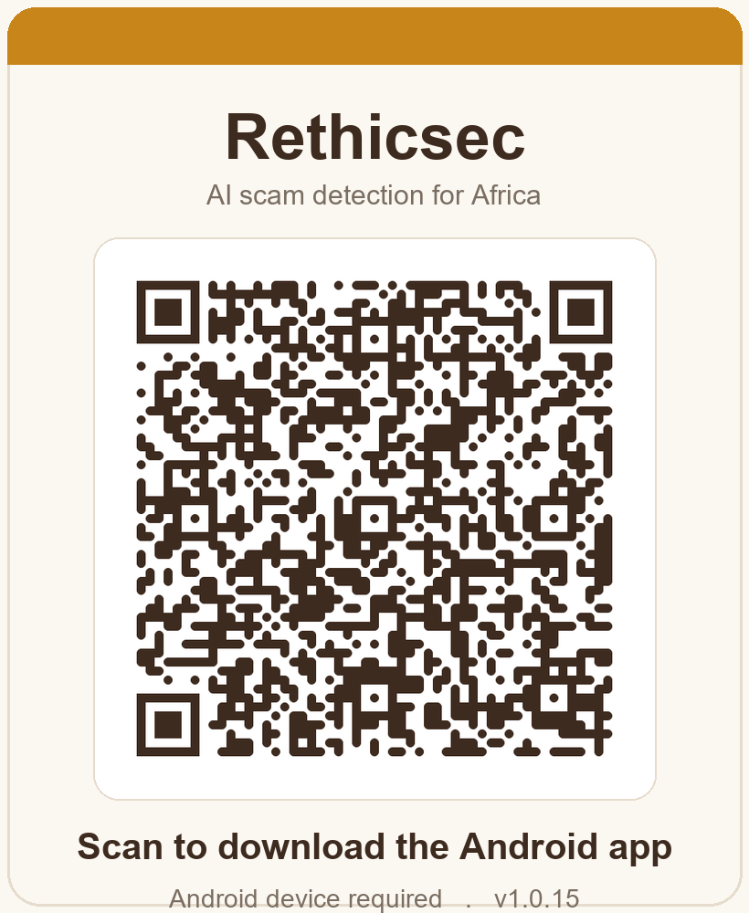
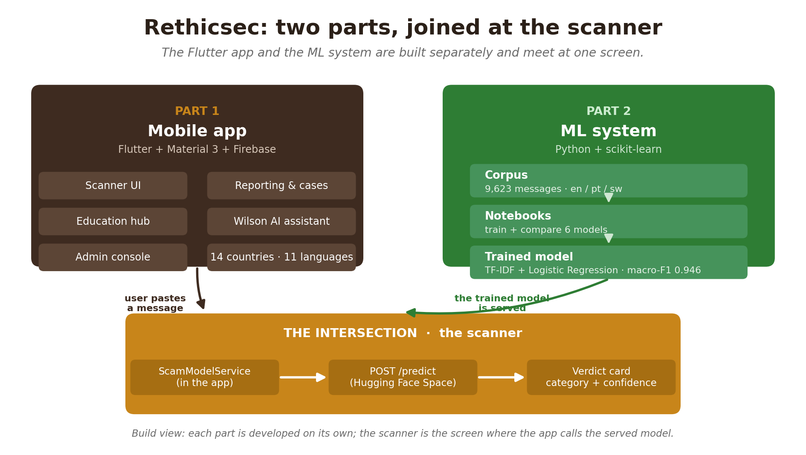
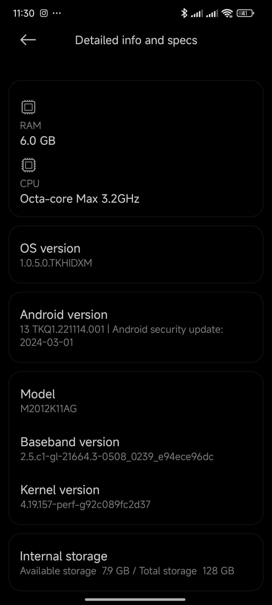
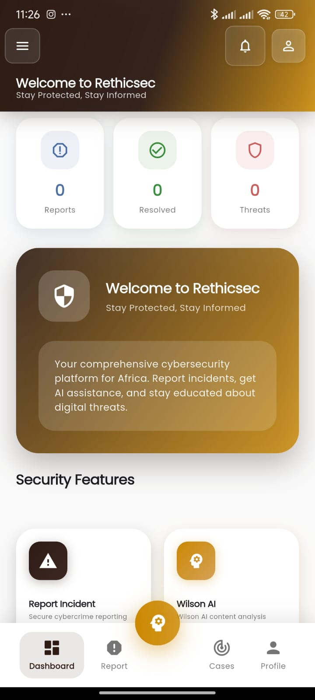
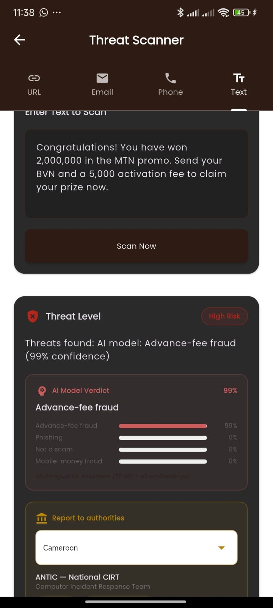
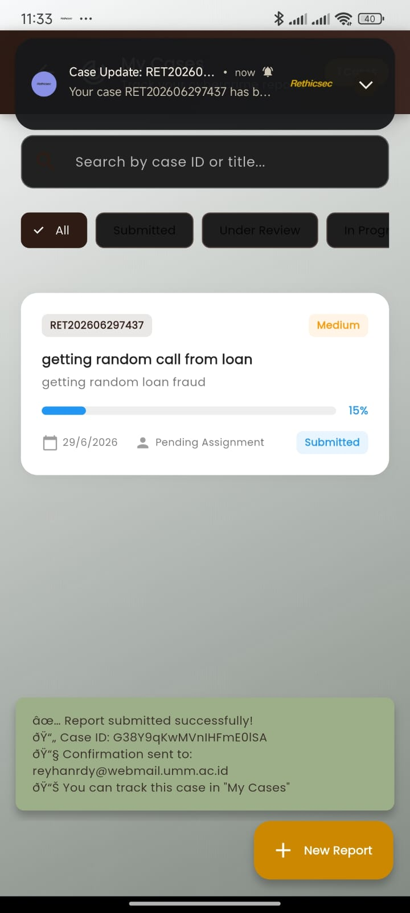
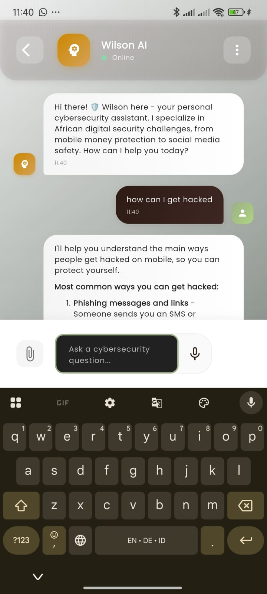

<h1 align="center">Rethicsec</h1>

<p align="center"><strong>AI-powered scam detection and cybercrime reporting for Africa</strong></p>

<p align="center">
  <a href="https://github.com/Wilsons-Navid/Capstone-Project/releases/download/v1.0.15/rethicsec-v1.0.15.apk"></a>
  
  
  
  <a href="https://drive.google.com/file/d/1oKkNTARQLZ0C4FiUFOgcdcH0d9YUOo9e/view?usp=sharing"></a>
</p>

| | |
|---|---|
| **Author** | Wilsons Navid Wado Tiwa, BSc Software Engineering, African Leadership University |
| **Product** | Rethicsec mobile app (Flutter + Firebase + a custom Python ML scam classifier) |
| **Status** | Implementation and Testing milestone. The deployed Android build is linked below. |

<p align="center">
  
</p>
<p align="center">
  There is no iOS or web build. Full install steps are in <a href="#1-deployed-version-download-and-install-android">section 1</a>.
</p>

**Rethicsec answers a simple question for everyday users: is this message a scam?** It gives a clear verdict
in seconds and then helps the user act on it, including reporting the scam to the right national authority.
The app uses custom-trained, multilingual scam classifiers rather than a general-purpose LLM, together
with an education hub, an AI assistant, and an authority-reporting directory that covers 14 African
countries. Detection runs in two stages: a fast binary "scam or not" model backs the SMS inbox feature,
and a four-class model backs the manual scan, naming the scam type (advance-fee fraud, mobile-money fraud,
phishing, or not-a-scam). Both are trained on real African scam messages in **English, Portuguese, Swahili,
and Kinyarwanda**, the last from a live smishing honeynet run by the Upanzi Network at CMU-Africa.

> **Why it matters: the reporting gap.** Cybercrime in Africa is badly under-reported. INTERPOL estimates
> that fewer than 20% of incidents are ever formally logged, so the official statistics, and the
> institutional response built on them, cover only a fraction of what actually happens. Rethicsec is built
> to lower the barrier to reporting. It reaches victims where the scam reaches them, on their phone and in
> their language, converts a confusing message into a clear verdict, and routes a structured report to the
> right authority in one tap. Each report also adds to a regional scam dataset the field currently lacks, so
> the platform works on the reporting gap and the data gap at the same time.

### At a glance

| | |
|---|---|
| Download | [`rethicsec-v1.0.15.apk`](https://github.com/Wilsons-Navid/Capstone-Project/releases/download/v1.0.15/rethicsec-v1.0.15.apk) (Android, 74 MB) |
| Live model APIs | Scan: https://wadotuh-scam-classifier-api-v3.hf.space · SMS: https://wadotuh-cmu-scam-inbox-guard.hf.space |
| Deployed models | Manual scan: four-class TF-IDF + LogReg (v3, macro-F1 0.932). SMS feature: binary inbox detector (scam-F1 0.87). |
| Corpus | 10,722 messages, 4 classes, 4 languages (English, Portuguese, Swahili, Kinyarwanda) |
| App | Flutter + Firebase, 11 locales, authority reporting for 14 countries |
| Demo | [5-minute walkthrough](https://drive.google.com/file/d/1oKkNTARQLZ0C4FiUFOgcdcH0d9YUOo9e/view?usp=sharing) |

## Table of contents

1. [Deployed version: download and install (Android)](#1-deployed-version-download-and-install-android)
2. [Run or build from source (developers)](#2-run-or-build-from-source-developers)
3. [What the app does (core functionality)](#3-what-the-app-does-core-functionality)
4. [How it is built: two parts and their intersection](#4-how-it-is-built-two-parts-and-their-intersection)
5. [Testing results](#5-testing-results)
6. [Analysis: results against the project objectives](#6-analysis-results-against-the-project-objectives)
7. [Discussion: why the milestones matter](#7-discussion-why-the-milestones-matter)
8. [Recommendations and future work](#8-recommendations-and-future-work)
9. [Repository map](#9-repository-map)
10. [Tech stack](#10-tech-stack)
11. [Demo video](#11-demo-video)

## 1. Deployed version: download and install (Android)

> **Direct APK download:**
> https://github.com/Wilsons-Navid/Capstone-Project/releases/download/v1.0.15/rethicsec-v1.0.15.apk
>
> **Release page:** https://github.com/Wilsons-Navid/Capstone-Project/releases/tag/v1.0.15
>
> **Model APIs (Hugging Face):** the scan uses https://wadotuh-scam-classifier-api-v3.hf.space and the SMS feature uses https://wadotuh-cmu-scam-inbox-guard.hf.space (all model APIs are listed in section 4)

**Step-by-step install:**
1. On an Android phone, open the direct APK link above in a browser.
2. Tap Download; when it finishes, tap the file to open it.
3. Android may warn about "Install from unknown sources". Tap Settings, then Allow from this source. This is normal for apps installed outside an app store.
4. If Google Play Protect shows a warning, tap More details, then Install anyway. The build requests SMS-reading permissions, which Play Protect flags for sideloaded apps.
5. If there is no "Install anyway" option, open Play Store, tap your profile, then Play Protect, then Settings, turn off scanning, install the app, and turn scanning back on.
6. Open Rethicsec, create an account or sign in with Google, and you are in.

No desktop or developer tools are needed to run the deployed app. The APK is enough.

## 2. Run or build from source (developers)

**Prerequisites:** [Flutter](https://docs.flutter.dev/get-started/install) 3.x, Android Studio or the Android SDK, and a device or emulator.

```bash
# 1. Clone
git clone https://github.com/Wilsons-Navid/Capstone-Project.git
cd Capstone-Project/mobile/rethicsai

# 2. Install dependencies
flutter pub get

# 3. Run on a connected device / emulator
flutter run

# 4. (optional) Build your own release APK
flutter build apk --release
# output: build/app/outputs/flutter-apk/app-release.apk
```

The app ships with its Firebase configuration, so no extra backend setup is needed to run it.

## 3. What the app does (core functionality)

| Feature (name in the app) | What it does |
|---|---|
| Threat Scanner | Paste an SMS, email, URL, phone number or message; the four-class model returns a threat level, a category, and an explanation. |
| SMS Protection | Scan your inbox or live-classify incoming SMS with the binary scam-or-not model, trained on real captured SMS (Android only). |
| Report to authorities | Country-aware directory (14 countries) of police, cyber-crime, and financial-crime units. Call, email, or report online with a pre-filled message. |
| Report Incident | Structured report with evidence upload, geolocation, and priority. |
| Track Cases | Status timeline for submitted cases. |
| Learn & Protect | Lessons (video and interactive) with gamification and certificates. |
| Wilson AI | Conversational cyber-safety questions and answers (Claude Haiku). |
| Need Immediate Help? | Emergency-contacts directory for quick access during an active fraud. |
| Dashboard and Notifications | Personal security overview and a real-time alerts inbox. |
| Admin Panel | Manage authority contacts (add, edit, delete countries), moderate content, review cases. |
| Language | 11 locales: English, French, Swahili, Hausa, Yoruba, Igbo, Zulu, Xhosa, Afrikaans, Arabic, Duala. |

### 3.1 App screenshots

<p align="center">
  
  
  
</p>
<p align="center"><em>Dashboard, the threat scanner, and the scan input.</em></p>

<p align="center">
  
  
  
</p>
<p align="center"><em>Report-to-authorities actions, a mobile-money scan, and the security features.</em></p>

<p align="center">
  
  
  
</p>
<p align="center"><em>The education hub, the Wilson AI assistant, and the admin dashboard.</em></p>

<p align="center">
  
  
</p>
<p align="center"><em>Incident reporting.</em></p>

## 4. How it is built: two parts and their intersection

Rethicsec has two engineered parts that meet at one screen.

- **Part 1, the mobile app** (`mobile/rethicsai/`): a Flutter and Material 3 client. It holds the scanner
  UI, structured reporting, case tracking, the education hub, the Wilson assistant, the admin console, the
  14-country authority directory, and 11 languages, backed by Firebase (Auth, Firestore, Cloud Functions,
  FCM).
- **Part 2, the ML system** (`ml/`): the research core. It holds a four-class scam corpus of **10,722
  messages across English, Portuguese, Swahili, and Kinyarwanda**, the training and evaluation notebooks,
  and the trained classifiers served behind `/predict` APIs. The corpus grew in stages: public English and
  Portuguese datasets, then real African SMS (Nigerian ExAIS and Tanzanian BongoScam), and most recently a
  capture from the **CMU-Africa Upanzi smishing honeynet** of live mobile-money fraud. Two models are
  deployed. The manual scan uses the **four-class v3 model**, TF-IDF + Logistic Regression retrained on the
  honeynet-enriched corpus (macro-F1 0.932 on the realistic test set, five points above the same recipe
  without the honeynet data). The SMS feature uses a **binary scam-or-not model** trained only on the
  honeynet capture. Both are pure scikit-learn with no embedder to download, so they cold-start instantly.
  The full model story and every comparison are in [`ml/README.md`](ml/README.md).
- **The intersection, the scanner.** This is where the two parts meet. A user pastes a message, the app's
  `ScamModelService` calls the four-class model's `/predict` endpoint, and the returned category and
  confidence are shown in the verdict card. The SMS feature calls the binary model the same way. A warm-up
  ping on app launch keeps the hosted models responsive, so the user sees the live verdict instead of a
  keyword fallback.


<p align="center"><em>Build view: each part is developed on its own, and the scanner is the screen where the app calls the served model.</em></p>

The diagram below traces the same idea at run time: a pasted message makes a round trip from the app to the hosted model and back to the verdict card.


### 4.1 Try the model APIs directly

Each model has its own public Hugging Face Space. The app calls two of them: the four-class **v3** model
for the manual scan and the **binary** detector for the SMS feature. The other three are the previous
four-class model and the documented baseline and embedding ensemble. The reasoning behind keeping them all
is in [`ml/README.md`](ml/README.md).

| Model | API base URL | What it serves |
|---|---|---|
| **v3 four-class (the app's scan)** | https://wadotuh-scam-classifier-api-v3.hf.space | TF-IDF + LogReg on the honeynet-enriched corpus (en/pt/sw/rw), macro-F1 0.932. |
| **Binary inbox (the app's SMS feature)** | https://wadotuh-cmu-scam-inbox-guard.hf.space | Scam-or-not, trained on the CMU honeynet capture, scam-F1 0.87. Returns `{is_scam, scam_probability, verdict}`. |
| Final v2 four-class | https://wadotuh-scam-classifier-api-final.hf.space | TF-IDF + LogReg, v2 corpus (en/pt/sw), macro-F1 0.946. The previous scan model. |
| Embedding ensemble | https://wadotuh-scam-classifier-api-embed.hf.space | TF-IDF + e5-small soft-voting ensemble, v1 corpus, macro-F1 0.955 |
| Initial baseline | https://wadotuh-scam-classifier-api-initial.hf.space | TF-IDF + LogReg, v1 corpus (the first baseline) |

- **Endpoint (all):** `POST /predict`
- **Request body:** `{ "text": "<message to classify>" }`

**Example (curl), a Swahili mobile-money lure on the four-class scan model:**

```bash
curl -X POST https://wadotuh-scam-classifier-api-v3.hf.space/predict \
  -H "Content-Type: application/json" \
  -d '{"text":"Iyo pesa itume kwenye namba hii ya Airtel 0689933027 jina PETER NYANGE."}'
```

**Example response:**

```json
{
  "predicted_category": "mobile_money_fraud",
  "confidence": 0.9966,
  "scores": {
    "advance_fee_fraud": 0.0012,
    "mobile_money_fraud": 0.9966,
    "phishing": 0.0009,
    "not_a_scam": 0.0013
  }
}
```

> The v3 and binary models are pure scikit-learn (no embedder to download), so a warm request answers in
> about a second and there is no 470 MB cold-start download. Each Space still sleeps when idle, so only the
> first request after a pause waits a few seconds for the container to wake (the app hides this with a
> warm-up ping). In the mobile app the scan URL is set with the `SCAM_MODEL_API` dart-define and the SMS
> URL with `SCAM_BINARY_API`, for example
> `flutter run --dart-define=SCAM_MODEL_API=https://<your-space>.hf.space`; they default to the v3 and
> binary Spaces above. The embedding-ensemble Space downloads the e5 weights on its first request.

## 5. Testing results

> Screenshots referenced below live in `docs/assets/`. Add your captured images there.

### 5.1 Testing strategies

| Strategy | What it covers | How to run / evidence |
|---|---|---|
| Automated unit tests | Validation and sanitization logic (`SecurityUtils`), bundled authority-contacts data, theme tokens. | `cd mobile/rethicsai && flutter test` |
| Automated widget tests | Theme renders, `EarthColors` extension resolves, Material 3 enabled. | included in `flutter test` |
| Manual / functional testing | Core user flows: scan, verdict, report; dashboard; admin CRUD. | screenshots (section 5.2) |

Automated test run (all green):

```text
$ flutter test
00:03 +36: All tests passed!
```


### 5.2 Functionality with different data values (the scanner)

The scanner was tested with one real message per class (taken from the corpus). Each returned the correct
category and risk level from the AI model, with the model's confidence shown on screen:

| Input (corpus message) | Model category | Verdict | Confidence |
|---|---|---|---|
| "URGENT! ...you have won a £900 prize GUARANTEED. Call 09061701939. Claim code S89. Valid 12hrs only" | Advance-fee fraud | HIGH RISK | 96% |
| "...FAIZAL ALBERTO BERNADO" (Mozambican M-Pesa lure, Portuguese) | Mobile-money fraud | HIGH RISK | 85% |
| "TKO NOTICE: Compromised Accounts - eBay Registration Suspension" | Phishing | HIGH RISK | 97% |
| "Okey dokey, i'll be over in a bit just sorting some stuff out." | Not a scam | SAFE | 97% |

<p align="center">
  
  
  
  
</p>

The verdicts use the deployed model (the cards read "AI Model Verdict" with a confidence bar), and each
verdict is shown by icon, colour, and text together (red for scam, green for safe).

### 5.3 Performance on different hardware / software

The app was tested on two physical phones from different manufacturers, running two different Android
versions and two RAM tiers. On both devices all core flows (launch, navigation, scan, and report) ran
smoothly, which shows the app is not tied to a single device or Android build.

| Device | Android version | RAM | Chipset | Result (launch, scan, report) | Screenshot |
|---|---|---|---|---|---|
| Infinix Note 50 Pro (X6855), physical | Android 15 | 8 GB | — | Smooth; all core flows worked | `docs/assets/perf_phone.png` |
| Xiaomi (model M2012K11AG), physical, MIUI | Android 13 (build TKQ1.221114.001) | 6 GB | Octa-core, max 3.2 GHz | Smooth; launch, navigation, scan and report all worked | `docs/assets/perf_phone2_specs.jpg`, `docs/assets/perf_phone2_scan.jpg` |

<p align="center"></p>

Second device (Xiaomi M2012K11AG, Android 13, 6 GB) — device specs, dashboard, scanner verdict, case
list, and the AI assistant:

<p align="center">
  
  
  
  
  
</p>

**Analysis.** The two devices span a meaningful range: a Transsion/Infinix handset on Android 15 with 8 GB
of RAM, and a Xiaomi/MIUI handset on Android 13 with 6 GB. Across both, the app launched without errors,
navigated smoothly, and produced correct model verdicts — on the second device the scanner correctly
classified an MTN advance-fee ("you have won 2,000,000... send your BVN and a 5,000 activation fee") as
advance-fee fraud at 99% confidence, a report submitted from the device reached the case list, and the AI
assistant responded normally. The consistent behaviour across two manufacturers, two Android versions, and
two RAM tiers indicates the build degrades gracefully on lower-memory hardware and does not depend on a
single OEM's Android customisation.

**Defect found and fixed during this round of testing.** The second-device run surfaced a text-encoding
defect: the report-submission confirmation (visible in the case-list screenshot above) rendered emoji and
accented characters as garbled "mojibake" because two source files had been saved with a broken character
encoding. The defect was diagnosed (UTF-8 bytes mis-saved as Latin-1), fixed by repairing the encoding,
removing the emojis from the report messages, and replacing the language-picker flag emojis with clean
language-code badges, and shipped in build v1.0.14. The screenshot is kept here as the "before" evidence of
the testing process catching and resolving a real defect.

## 6. Analysis: results against the project objectives

### 6.1 What the proposal committed to against what was delivered

The proposal (Chapter 1) set three SMART objectives. The implementation met or exceeded all three.

| Proposal objective | Committed to | Delivered | Verdict |
|---|---|---|---|
| Obj 1, Corpus | A labelled West African scam corpus of at least 500 incidents across the typology. | 10,722 labelled messages across 4 classes (advance-fee, mobile-money, phishing, not-a-scam) and 4 languages (English, Portuguese, Swahili, Kinyarwanda), from Nazario, UCI-SMS, Mozambique and Mendeley smishing, regional news, the **ExAIS African-English SMS set (Nigeria)**, the **BongoScam Tanzanian Swahili set**, and a capture from the **CMU-Africa Upanzi smishing honeynet**. | Exceeded (about 21 times the target) |
| Obj 2, Platform | Deploy a mobile platform integrating reporting, classification, risk assessment, and education. | Flutter app with all four, plus the assistant, admin console, and 14-country authority reporting; installable APK. | Exceeded |
| Obj 3, Model comparison | Compare two classical baselines (TF-IDF with logistic regression against TF-IDF with random forest), per-category metrics. | Compared six models on the expanded corpus with per-language and per-class breakdowns; then, once the CMU honeynet data arrived, ran a further controlled experiment and retrained. The deployed scan model is now the **four-class v3 (TF-IDF + logistic regression, macro-F1 0.932 on the harder honeynet-inclusive test set, +5 points over the same recipe without that data)**, paired with a **binary inbox model** for the SMS feature. | Exceeded scope |
| Regional scope | Nigeria and Cameroon | Authority reporting for 14 countries | Exceeded |
| Language scope | English and French (Pidgin where possible) | App localised to 11 languages; corpus is English, Portuguese, Swahili, and Kinyarwanda | Partly diverged |

Honest deviations from the proposal:

- Obj 3 was scoped as a classical-only, two-baseline comparison. The delivered work went beyond it by adding multilingual e5 embeddings and ensembles. On the larger, keyword-rich African corpus the classical TF-IDF + logistic-regression model is again the strongest single model (macro-F1 0.946), narrowly ahead of the ensemble; the embeddings act as cross-lingual insurance rather than a leaderboard win. The final report should frame the embeddings and ensembles as an extension beyond, and a fair comparison against, the proposed classical baselines.
- The corpus language mix is English, Portuguese, Swahili, and Kinyarwanda, not the English and French the proposal targeted. Three real African sources were added since the first milestone (the ExAIS African-English SMS set from Nigeria, the BongoScam Tanzanian Swahili set, and the CMU-Africa Upanzi honeynet capture), which materially improved African coverage. French and Pidgin coverage in the model remains thin, even though the app localises to 11 languages.
- Corpus provenance: the corpus is labelled by scam typology. It now combines public English and Portuguese smishing and phishing datasets (UCI SMS, Nazario, the Mozambican M-Pesa set, Mendeley) with two real African SMS datasets (ExAIS, BongoScam). The African additions are relabelled from their native binary labels into the four-class typology by a documented, auditable rule set (`ml/scripts/11_relabel_african.py`), and these remain heuristic and provenance labels pending the inter-rater kappa audit. A corpus collected first-hand from West African victims is still future work, so the "West African corpus" framing should be read as typology-aligned and now partly region-native rather than fully field-collected. Full source links are in `docs/DATA_SOURCES.md`.

### 6.2 The ML analysis (figures from `ml/notebooks/`)

Example messages from the corpus, two per class. These are verbatim records from
`ml/data/labelled/demo_labeled.jsonl` (the JSON Lines training file), in their stored dictionary form,
with the original spelling and encoding preserved:

```json
{"id": "13766c415bc9", "text": "FREE entry into our £250 weekly competition just text the word WIN to 80086 NOW. 18 T&C www.txttowin.co.uk", "language": "en", "category": "advance_fee_fraud", "source": "uci_sms"}
{"id": "cfba88227a34", "text": "As a valued customer, I am pleased to advise you that following recent draw of your Mobile No. you are awarded with a Rs.2,00,000 Bonus Prize, call 6200992462", "language": "en", "category": "advance_fee_fraud", "source": "mendeley_smishing"}
{"id": "22b1f0f110b5", "text": "boa tarda, o valor pod-me mandar neste nr: 857217192, na conta M-Pesa vem em nome de FAIZAL ALBERTO BERNADO.", "language": "pt", "category": "mobile_money_fraud", "source": "moz_smishing"}
{"id": "938101622afe", "text": "A Minha Conta Tem Problema, Transfere Neste Número 857857934 Porfavor Aparece Nome Da Monica Rui.", "language": "pt", "category": "mobile_money_fraud", "source": "moz_smishing"}
{"id": "90369829fb76", "text": "Notification Of your eBay Internet Account Security", "language": "en", "category": "phishing", "source": "nazario_email"}
{"id": "b314f26279d8", "text": "Verify Your Details With SouthTrust Bank [Sun, 22 May 2005 13:21:14 +0200]", "language": "en", "category": "phishing", "source": "nazario_email"}
{"id": "afb1a063028b", "text": "Wif my family booking tour package.", "language": "en", "category": "not_a_scam", "source": "uci_sms"}
{"id": "e08140acbb70", "text": "How abt making some of the pics bigger?", "language": "en", "category": "not_a_scam", "source": "uci_sms"}
```

> Note: each record has `id`, `text`, `language`, `category`, and `source`. These examples are from the
> original v1 corpus. In the current v2 corpus the `mobile_money_fraud` class is no longer
> Portuguese-only: it is now carried by Mozambican M-Pesa smishing (Portuguese) **and** Tanzanian Swahili
> mobile-money lures from the BongoScam set (for example, "Iyo pesa itume kwenye namba hii ya Airtel
> 0689933027" means "send that money to this Airtel number"). The corpus is therefore English,
> Portuguese, and Swahili; French and Pidgin coverage in the model is still thin (see section 6.1).

The figures below are from the **v1 corpus (4,422 messages)**, the milestone-1 analysis. The
**v2 corpus (9,623 messages)** results that follow are reproduced live in
`ml/notebooks/final_model/final_model.ipynb`.

Corpus and class imbalance (v1). Phishing dominates; mobile-money and advance-fee are the minority classes, which is the root cause of the bias discussed below:


Model comparison (v1). Of six models, the soft-voting ensemble wins at macro-F1 0.955, above the 0.943 TF-IDF with logistic-regression baseline:


Confusion matrix (v1 deployed ensemble). It is strong on the diagonal in-distribution; the visible leakage is advance-fee predicted as phishing:


Re-balancing ablation (v1). Class-weighting, over-sampling, and the combined strategy all converge to the same per-class recall, and none beats the others on the hard advance-fee class. This confirms that data, not the algorithm, is the limit:


**v2 results, after adding the African data.** Retraining the same model ladder on the expanded
9,623-message corpus (English, Portuguese, Swahili) gives:

| Model | Accuracy | Macro-F1 |
|---|---|---|
| **TF-IDF + Logistic Regression (deployed)** | **0.965** | **0.946** |
| Soft-voting ensemble | 0.959 | 0.941 |
| Stacking ensemble | 0.958 | 0.937 |
| TF-IDF + Random Forest | 0.936 | 0.913 |
| e5 embeddings + Logistic Regression | 0.929 | 0.899 |
| e5 embeddings + Random Forest | 0.918 | 0.884 |

- **Mobile-money fraud went from the weakest class to the strongest** (per-class F1 0.983), because the
  Swahili BongoScam data joined the Portuguese M-Pesa data in that class. This directly addresses the
  cross-lingual mobile-money gap reported at milestone 1. Advance-fee remains the hardest class (F1 0.874).
- **The model works in every language it was given:** per-language test accuracy is English 0.95,
  Portuguese 1.00, Swahili 0.98.
- The keyword-rich African data favours the lexical model, so TF-IDF + logistic regression is again the
  best single model; the multilingual embeddings add cross-lingual robustness but do not top the board.

**v3 results, after adding the CMU honeynet.** After the v2 milestone, a capture from the CMU-Africa Upanzi
smishing honeynet (real mobile-money fraud in English, Kinyarwanda, and Swahili) was folded into the corpus
to make v3 (10,722 messages). A controlled experiment held the model recipe fixed and changed only the
training data: on one shared, harder test set that includes the honeynet messages, the same TF-IDF +
logistic-regression recipe scores macro-F1 0.881 without the honeynet data and **0.932 with it**, a
five-point gain driven by mobile-money (per-class F1 0.952). Re-checking embeddings on v3 reached the same
verdict as before (TF-IDF 0.932 beats e5 0.874), so the shipped scan model stays lexical. The honeynet
capture also trained a **binary scam-or-not model** (scam-F1 0.87) that now backs the SMS feature: a fast
first pass for the inbox, with the four-class model as the second opinion. The honeynet data is gated, so it
is credited to the Upanzi Network at CMU-Africa but not redistributed; the full comparison is in
[`ml/README.md`](ml/README.md).

### 6.3 Where results fell short, and what the ML experiments showed

At milestone 1, the 0.955 figure was in-distribution and the v1 corpus was class-imbalanced (phishing
about 2,401, then not-a-scam about 1,200, then mobile-money about 538, then advance-fee about 283). The
v1 model inherited a majority-class bias toward phishing, and genuine mobile-money and advance-fee scams
(and occasionally even legitimate messages) drifted toward phishing at low confidence. A controlled
re-balancing ablation (testing class-weighting, over-sampling, under-sampling, and combined) showed that
re-balancing the existing data could not create signal that was not there: the binding constraint was the
**volume of authentic minority-class data, not the algorithm**.

That diagnosis drove the v2 work. Acting on it, two real African SMS datasets were sourced and added (the
ExAIS African-English set and the Tanzanian Swahili BongoScam set), which roughly doubled the two scarce
classes (mobile-money 538 to 1,166, advance-fee 283 to 597) and added a third language. The payoff is
direct: **mobile-money fraud became the strongest class (F1 0.983)** and the model now reads Swahili and
Portuguese, not just English. The minority-data constraint the ablation identified has been substantially
eased. The most recent step acted on that same diagnosis once more: the requested capture from CMU-Africa's
Upanzi smishing honeynet arrived and was folded into the corpus (v3), which in a controlled same-test-set
comparison lifted the four-class model from macro-F1 0.881 to 0.932 and strengthened the mobile-money class
in Kinyarwanda and Swahili. That capture also trained a separate binary inbox model now used by the SMS
feature. Advance-fee remains the hardest class.

A separate finding concerns serving reliability. The v1 model was an e5 ensemble that had to download a
470 MB embedder on first request; on a Space that sleeps when idle this could time out and the app would
fall back to weaker keyword heuristics. The v2 model removes the cause entirely: it is pure scikit-learn
(about 1.5 MB, no embedder), so it cold-starts instantly and answers a warm request in about a second. The
warm-up ping on app launch is retained to mask the container wake from idle, so users reliably see the
model verdict rather than the fallback.

## 7. Discussion: why the milestones matter

- Because fewer than 20% of African cybercrime incidents are ever formally reported, the harder problem is
  not detecting scams but giving people a low-friction way to report them. Rethicsec provides that
  path: a non-technical victim can report a scam in their own language, in one tap, the moment it happens.
  That reporting data is also what downstream institutional responses depend on.
- Detection on its own is only half the job. This milestone matters because it closes the loop: a verdict
  becomes a one-tap report to a real authority in the user's country.
- Building a custom classifier instead of calling a third-party LLM means the model is tuned to African
  scam patterns and languages, and every confirmed report can improve it. That data advantage is hard for
  competitors to copy by translating a user interface.
- Proving that no re-balancing strategy fixes the out-of-distribution failures is a useful result in
  itself. It points effort away from algorithm tweaks and toward acquiring real, labelled, local scam
  data. Knowing what does not work kept the project from chasing a dead end.
- A 0.955 model is useless if the user sees a keyword fallback because the service was cold. The warm-up
  fix is a reminder that for a deployed model, serving reliability matters as much as offline accuracy.
- Accessibility and clarity are not cosmetic. Showing each verdict as an icon, a colour, and a text label,
  meeting WCAG AA contrast, and supporting 11 languages all decide whether a non-technical user actually
  understands the guidance.

## 8. Recommendations and future work

- Confidence-aware verdicts: show the model's confidence and add an explicit "unsure, treat with caution" state to cut false positives and build trust.
- Collect authentic minority-class data (mobile-money and advance-fee). This was the single biggest lever on accuracy, as the re-balancing ablation showed. v2 acted on it by adding the ExAIS and BongoScam African SMS sets, and v3 went further by folding in the CMU-Africa Upanzi honeynet capture of real mobile-money fraud, so mobile-money is now the strongest class across four languages. The remaining gap is advance-fee volume, which stays the hardest class; a human inter-rater labelling pass over the honeynet-derived labels is the next step.
- On-device inference: a quantised model for offline, private screening on low-connectivity networks.
- Multi-modal detection: images, link reputation, and voice notes.
- Consent-based escalation tiers: from helping the user act today to partnerships with operators and regulators.
- Community outreach: promote the app through telco and community-organisation channels where scam exposure is highest.

## 9. Repository map

```
Capstone-Project/
├── README.md                     ← this file (submission entry point)
├── mobile/rethicsai/             ← the Rethicsec Flutter app
│   ├── lib/                      ← app source (features/, core/, shared/)
│   ├── test/                     ← automated tests (flutter test, 36 passing)
│   └── design-system/MASTER.md   ← the design-system contract
├── ml/                           ← scam-classifier research (corpus, notebooks, serving)
│   └── README.md                 ← the models (baseline → v3 → binary), the results, and why each one ships
├── docs/
│   ├── DATA_SOURCES.md           ← source links and licences for every dataset
│   └── assets/                   ← screenshots and the architecture diagrams used in this README
└── scripts/                      ← repository utilities (for example, the release QR generator)
```

## 10. Tech stack

Flutter (Dart), Material 3, Firebase (Auth, Firestore, Cloud Functions, FCM), a Python ML service
(scikit-learn TF-IDF + logistic-regression classifier, with a multilingual e5 ensemble compared against
it), FastAPI on a Hugging Face Docker Space, Claude Haiku for the assistant, and 11 locales.

## 11. Demo video

**5-minute demo (core functionality):** https://drive.google.com/file/d/1oKkNTARQLZ0C4FiUFOgcdcH0d9YUOo9e/view?usp=sharing

> The video focuses on the core flows (scanning different messages, the verdict, reporting to authorities,
> the education hub, and the assistant) rather than sign-up or sign-in.
