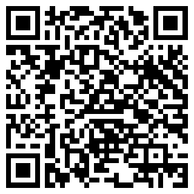

# Capstone — AI-Powered Cybercrime Reporting & Scam Detection in West Africa

**Author:** Wilsons Navid Wado Tiwa — BSc Software Engineering, African Leadership University
**Today:** 2026-05-22
**Status:** New supervisor assigned 2026-05-22. **Research proposal being rewritten from scratch** under the new course templates. Working deadline ~31/5/26.

---

## 📱 Download the app (Android APK)

Scan the QR code or use the link below to install the RethicsAI mobile app on an Android device.



- **Release page:** https://github.com/Wilsons-Navid/Capstone-Project/releases/tag/v1.0.2
- **Direct download:** https://github.com/Wilsons-Navid/Capstone-Project/releases/download/v1.0.2/RethicsAI-v1.0.2.apk

> On first install, Android may ask you to allow **“Install from unknown sources.”** This is normal for apps installed outside the Play Store. Signed release build — Google Sign-In works.

---

## Current focus — `proposal/`

The active workspace is `proposal/`. Section-by-section drafting:

1. Chapter 2 — Literature Review (drafted first per template)
2. Chapter 1 — Introduction
3. Chapter 3 — System Analysis & Design
4. Front matter (abstract, ToC, lists)
5. References (APA)

See `proposal/README.md` for status, rubric checkpoints, and the formatting/template spec.

---

## Course timeline (from `docs/IMG-20260522-WA0000.jpg`)

| Phase | Weeks | Dates | Weight |
|---|---|---|---:|
| Research proposal | W1–W3 | 4/5 – 22/5/26 | 19% |
| Initial Design & Development | W4–W5 | 25/5 – 5/6/26 | 0% |
| Final Capstone Implementation | W6–W8 | 8/6 – 26/6/26 | 15% |
| Final capstone project report | W9–W10 | 29/6 – 10/7/26 | 26% |
| Workshop Attendance | WK2–WK11 | 11/5 – 17/7/26 | 5% |
| Supervisor's Grade | W11 | 14/7 – 17/7/26 | 10% |
| Capstone Defense | W12–WK13 | 20/7 – 24/7/26 | 20% |
| Final Capstone Report Submission | WK13 | 27/7 – 31/7/26 | 5% |

---

## Workspace map

```
Capstone-Project/
├── README.md                ← this file
├── proposal/                ← ACTIVE: new proposal under new supervisor
│   ├── README.md            ← section status board, rubric, formatting spec
│   ├── sections/            ← one .md per section, drafted iteratively
│   └── assets/              ← diagrams + figures for the proposal
├── docs/                    ← templates, guideline, course timeline images
│   ├── Proposal Guidline.docx
│   ├── Copy of Machine Learnin Proposal_mission Capstone.docx   ← primary template
│   ├── Copy of Proposal_mission Capstone.docx                   ← general template
│   ├── IMG-20260522-WA0000.jpg   ← course assessments timeline
│   ├── Wilsodev.png              ← week-by-week module structure
│   └── archive/             ← obsolete old-supervisor-track docs (mineable, not deleted)
│       ├── old_supervisor_track/ (reconciliation memos, briefing slides, onboarding)
│       ├── pre_capstone_units/   (Units 1–4 + Pre-Capstone Major Assessment)
│       └── legacy_misc/          (older drafts, old workspace README)
├── mobile/                  ← Rethicssec Flutter app (existing implementation)
├── ml/                      ← ML research scaffold (skeleton code)
├── meetings/                ← weekly supervisor meeting notes (template)
├── pilot/                   ← placeholder (later phase)
└── dissertation/            ← placeholder (later phase)
```

Reference exemplar: `Mission Capstone Proposal_Chambeline Nkah.pdf` at workspace root.

---

## What carries forward, what doesn't

**Carries forward (still relevant):**
- Project topic: AI for cybercrime reporting + scam detection in West Africa
- Existing app at `mobile/rethicsai/` — Rethicssec v1.0.2+3, Flutter + Firebase
- ML scaffold under `ml/` — skeleton modules for baselines / LLM eval / dataset handling

**Archived (obsolete framing under previous supervisor):**
- Reconciliation Memo v1/v2/v3 + briefing slides + onboarding report → `docs/archive/old_supervisor_track/`
- Pre-Capstone Unit 1–4 deliverables → `docs/archive/pre_capstone_units/` (content mineable for the new lit review)
- Older miscellaneous drafts → `docs/archive/legacy_misc/`
