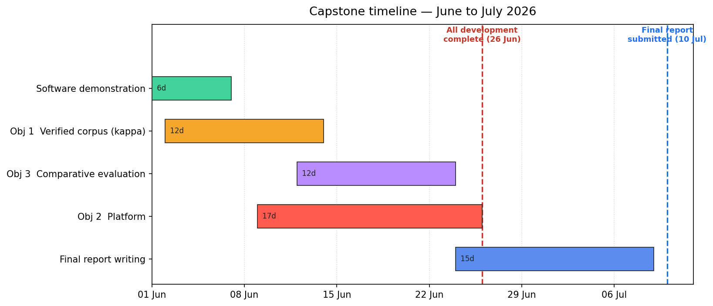

# Capstone: Next Steps and Roadmap

Date: 1 June 2026

This document summarises what the project has delivered so far and sets out the next
steps, both for the current software-demonstration milestone and for the capstone as a
whole. Under the revised schedule, all development (Objectives 1 to 3) is completed by
26 June 2026, and the final capstone report is submitted by 10 July 2026.

## 1. Where the project stands

- The proposal was approved by the supervisor on 28 May 2026, which opened the
  implementation phase.
- An initial software demonstration is built and deployed: a classical machine-learning
  classifier that sorts a short message into phishing, mobile-money fraud, advance-fee
  fraud, or not-a-scam. It uses TF-IDF features with Logistic Regression and Random Forest,
  and scores a test macro-F1 of 0.94 (held-out set, n = 664).
- It is served as a REST API (FastAPI, on Render) and a web app (on Vercel), with an
  executed model notebook and a clean repository.
- A working corpus has been pooled from public sources: 8,536 unique messages after
  de-duplication. The initial demonstration model is trained on a 4,422-row labelled
  subset, using each source's own labels.

## 2. A note on the labels

The demonstration model is an initial baseline. Its labels come from the source datasets
(provenance labels), not from a human adjudication process. The numbers are therefore
slightly optimistic, because the model partly learns which dataset a message resembles.
The final dissertation evaluation will run on a human, inter-rater-verified corpus, which
is the work described in Objective 1 below.

## 3. Immediate next steps (this week, demonstration milestone)

| Task | Owner | Status |
|---|---|---|
| Record the 5 to 10 minute demo video (notebook, then the live app) | Student | Pending |
| Add the video link to the repository README | Student | Pending |
| Submit the repository zip and the repo link | Student | Pending |
| Revoke the deployment tokens used during setup (Vercel, Render) | Student | Pending |
| Optionally lock the API CORS setting to the web-app domain | Student | Optional |

## 4. Objective 1: the verified corpus (internal target ~14 June)

This is the next major deliverable. The acceptance criterion is a labelled corpus of at
least 500 balanced items with Cohen's kappa of 0.7 or higher on a 100-item audit.

Steps:

1. Run the assisted labelling pass to produce at least 500 human-confirmed labels across
   the in-scope categories, prioritising a balanced set rather than the natural skew.
2. Recruit a second rater. Draw the 100-item blinded audit sample, have the second rater
   label it independently, and compute kappa.
3. If kappa is below 0.7, adjudicate the disagreements, refine the labelling guide, and
   re-rate the disputed items until the threshold is met.
4. Lock the corpus and produce the stratified 70/15/15 train/dev/test split. The test set
   is touched only once, at final evaluation.

Scope decision to confirm with the supervisor: three categories (phishing, mobile-money
fraud, advance-fee fraud) have enough real message data to train and evaluate. Romance,
identity-theft, and synthetic-media fraud do not, so they move to future work with a
documented sourcing rationale. The classifier ships as a three-category model plus a
not-a-scam class.

## 5. Objective 2: the platform (complete by 26 June)

The demonstration API and web app are the seed for the platform. Next steps:

1. Harden the API: input validation, a batch endpoint, model versioning, and request
   logging.
2. Improve the web front-end and connect it to the intended mobile delivery channel.
3. Containerise the service and move to stable hosting, with a simple retrain-and-deploy
   routine.

## 6. Objective 3: the comparative evaluation (complete by 26 June)

1. Retrain TF-IDF with Logistic Regression and TF-IDF with Random Forest on the verified
   corpus from Objective 1.
2. Report per-category precision, recall, and F1, plus macro-F1 and confusion matrices, on
   the held-out test set.
3. Run an error analysis and a language breakdown (for example English against Portuguese).
4. Compare the verified-corpus results against the initial source-labelled baseline to show
   the effect of proper labelling.

## 7. Data gaps and future work

- The thin categories (romance, identity-theft, synthetic-media) need data the public web
  does not provide as text. Options: Kaggle-token corpora, a data collaboration with the
  CMU-Africa smishing honeynet, or targeted collection. Synthetic-media (deepfake) fraud is
  audio and video, so it sits outside a text classifier and stays as future work.
- Language coverage leans English, with Portuguese mobile-money smishing as the main
  non-English slice. French and Pidgin coverage is thin and is a future-work item.
- Scraping regional news produced little usable signal, because articles report about fraud
  rather than being scam messages. Future collection should favour message datasets and
  institutional collaborations over news scraping.

## 8. Risks and mitigations

| Risk | Mitigation |
|---|---|
| Kappa below 0.7 on the first audit | Adjudicate and re-rate; the audit and kappa tooling already exists |
| Second-rater availability | Recruit a peer or colleague early in the labelling week |
| Source-label leakage inflates demo metrics | Report final numbers only from the verified corpus |
| Free-tier hosting cold starts | Acceptable for the demo; upgrade the plan if a live pilot is run |
| Category imbalance in the corpus | Cap per class or apply class weighting; report macro-F1 |

## 9. Timeline

Under the revised schedule, all development finishes by 26 June and the final report is
submitted by 10 July. Objectives 1, 2, and 3 overlap so the development work fits inside
the 26 June freeze; report writing then runs to the 10 July submission.

| Phase | Deliverable | Target date |
|---|---|---|
| Software demonstration | MVP plus video | Early June (this week) |
| Objective 1 | Verified corpus (kappa >= 0.7) | ~14 June (internal) |
| Objective 3 | Comparative evaluation | ~24 June (internal) |
| Objective 2 | Platform | 26 June |
| Development freeze | All development complete | 26 June 2026 |
| Final report | Capstone report submitted | 10 July 2026 |
