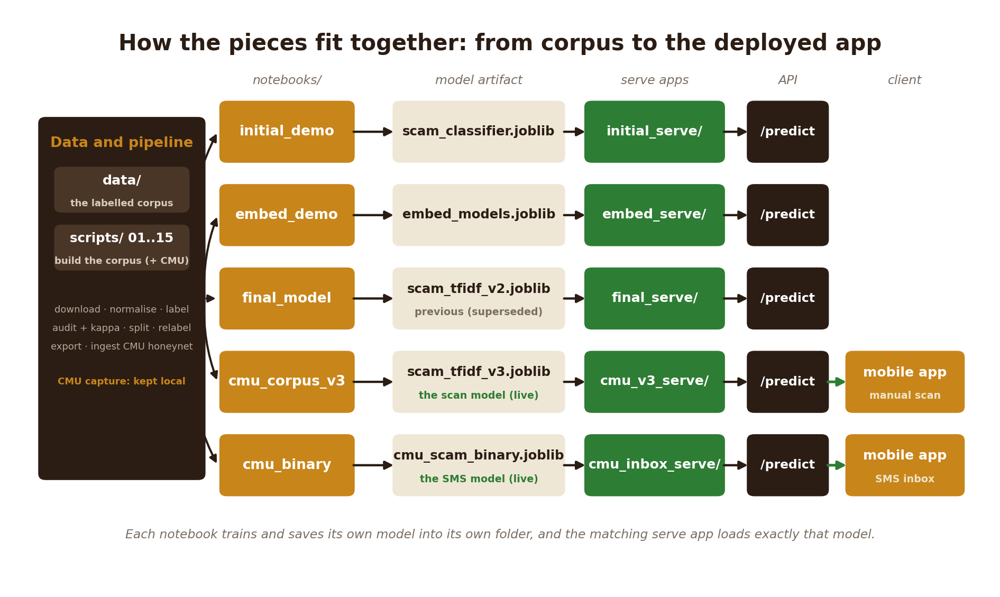

<h1 align="center"><code>ml/</code>: the scam-message classifier</h1>

<p align="center"><strong>The research core of Rethicsec: corpus, modelling experiments, and the deployed classifier</strong></p>

<p align="center">
  <a href="https://wadotuh-scam-classifier-api-v3.hf.space"></a>
  
  
  
  
</p>

This directory holds the research core of Rethicsec: the corpus, the modelling
experiments, and the two trained classifiers the mobile app calls. Detection runs in two
stages. A binary model settles the fast question, is this message a scam or not, and backs
the SMS inbox feature. A four-class model then names the kind of scam for the manual scan,
choosing among `advance_fee_fraud`, `mobile_money_fraud`, `phishing`, and `not_a_scam`.

The sections below explain what was built, how the models compare on real numbers,
and why the deployed ones were chosen.

## Table of contents

1. [Live model APIs](#live-model-apis)
2. [Why there are several models](#why-there-are-several-models)
3. [Results across the first three experiments](#results-across-the-first-three-experiments)
4. [Why the lexical model, not the ensemble](#why-the-lexical-model-not-the-ensemble)
5. [Real-world data, and two more models](#real-world-data-and-two-more-models)
6. [How the pieces fit together](#how-the-pieces-fit-together)
7. [Repository map](#repository-map)
8. [The corpus](#the-corpus)
9. [Reproducing the work](#reproducing-the-work)
10. [Data format and quality checks](#data-format-and-quality-checks)
11. [Taxonomy and deliverables](#taxonomy-and-deliverables)
12. [Acknowledgements](#acknowledgements)

## Live model APIs

All of these models are deployed, each behind its own public endpoint. Send a `POST`
request to `/predict` with a JSON body of `{"text": "..."}`. Interactive documentation is
at `/docs` on each Space. The two roles the mobile app uses are marked.

| Model | Live API | Summary |
|---|---|---|
| **Corpus v3 — four-class (the app's scan)** | https://wadotuh-scam-classifier-api-v3.hf.space | TF-IDF + Logistic Regression on the honeynet-enriched v3 corpus. Macro-F1 0.932 on the realistic test set, up 5 points over the same recipe without the honeynet data. No embedder, so it starts instantly. |
| **Inbox binary — scam or not (the app's SMS feature)** | https://wadotuh-cmu-scam-inbox-guard.hf.space | Trained only on the CMU-Africa Upanzi honeynet capture. Scam F1 0.87, precision-recall AUC 0.93. Recall-tuned fast first pass; returns `{is_scam, scam_probability, verdict}`. |
| Final v2 — four-class (previous scan model) | https://wadotuh-scam-classifier-api-final.hf.space | TF-IDF + Logistic Regression on the en/pt/sw corpus. Test macro-F1 0.946 on the v2 test set. Superseded by v3. |
| Embedding ensemble | https://wadotuh-scam-classifier-api-embed.hf.space | TF-IDF plus e5-small embeddings in a soft-voting ensemble. Test macro-F1 0.955 on the smaller corpus. |
| Initial baseline | https://wadotuh-scam-classifier-api-initial.hf.space | TF-IDF with Logistic Regression, the first baseline. |

A quick test against the current four-class model, using a Swahili mobile-money lure:

```bash
curl -X POST https://wadotuh-scam-classifier-api-v3.hf.space/predict \
  -H "Content-Type: application/json" \
  -d '{"text":"Iyo pesa itume kwenye namba hii ya Airtel 0689933027 jina PETER NYANGE."}'
# returns: {"predicted_category":"mobile_money_fraud","confidence":0.99, ...}
```

## Why there are several models

The project did not train a single model in isolation. It ran a sequence of experiments,
kept all of them, and deployed the ones the evidence supported. Each experiment asks a
specific question, and each builds on the answer to the previous one. Keeping them all
makes the reasoning auditable: a reader can open any notebook, follow the full experiment,
re-run it on its own, and compare the models directly.

The first three stages build the four-class classifier that ships. Stages four and five
came later, once a real capture of African scam messages arrived, and are covered in
[Real-world data, and two more models](#real-world-data-and-two-more-models).

| Stage | Notebook | The question it answers |
|---|---|---|
| 1 | [`notebooks/initial_demo/`](notebooks/initial_demo/) | Can a simple, inexpensive model classify these messages at all? It establishes a classical TF-IDF with Logistic Regression baseline on the first English and Portuguese corpus. This baseline is the control: a more complex model has to beat it to justify its cost. |
| 2 | [`notebooks/embed_demo/`](notebooks/embed_demo/) | Does modelling meaning, rather than keywords, improve results? It adds multilingual sentence embeddings (e5-small) and combines them with the lexical model in soft-voting and stacking ensembles. Its headline macro-F1 looked strong, but a per-class read exposed the real setback: the model kept misclassifying `mobile_money_fraud` and `advance_fee_fraud`, the two classes that mattered most and had the fewest training examples. That weakness is what motivated stage 3. |
| 3 | [`notebooks/final_model/`](notebooks/final_model/) | Can more data fix the two weak classes, and which model should ship? Because the embedding model failed on mobile-money and advance-fee messages, real African SMS was gathered (Nigerian ExAIS and Tanzanian BongoScam) to give those classes far more examples. The notebook repeats the full comparison on the expanded English, Portuguese, and Swahili corpus, then selects the model for deployment. After the data was added, the plain TF-IDF with Logistic Regression model came out on top, so it shipped as the first deployed model (later superseded by v3, stage 5). |
| 4 | [`notebooks/cmu_binary/`](notebooks/cmu_binary/) | The four-class model names the scam; can a separate, faster model just decide scam-or-not for the inbox scan, trained only on real scam messages caught in the wild? |
| 5 | [`notebooks/cmu_corpus_v3/`](notebooks/cmu_corpus_v3/) | Does folding that real honeynet data into the four-class corpus improve the weak mobile-money class without harming the rest? |

## Results across the first three experiments

These three stages build the four-class model and report on a held-out test split
(70/15/15, stratified, fixed seed). The two later honeynet notebooks use an 80/20 split and
are reported in [Real-world data, and two more models](#real-world-data-and-two-more-models).
The tables below give the full ladder, not only the winner, so the comparison is
transparent. Accuracy is overall correctness; macro-F1 averages the per-class F1 scores and
so weighs the rare scam classes as heavily as the common ones, which is why it is the
headline metric.

**Stage 1 baseline (4,422 messages, English and Portuguese), from `initial_demo`:**

| Model | Accuracy | Macro-F1 |
|---|---|---|
| TF-IDF + Logistic Regression | 0.958 | 0.943 |
| TF-IDF + Random Forest | 0.950 | 0.928 |

The baseline only fits the two lexical models. It is the control that stage 2 has to beat,
so the embedding work begins from these numbers.

**Stage 2, corpus v1 (the same 4,422 messages), from `embed_demo`:**

| Model | Accuracy | Macro-F1 |
|---|---|---|
| TF-IDF + Logistic Regression | 0.958 | 0.943 |
| TF-IDF + Random Forest | 0.950 | 0.928 |
| e5 embeddings + Logistic Regression | 0.953 | 0.926 |
| e5 embeddings + Random Forest | 0.952 | 0.910 |
| Soft-voting ensemble | **0.971** | **0.955** (best) |
| Stacking ensemble | 0.952 | 0.925 |

**Stage 3, corpus v2 (9,623 messages, English, Portuguese, and Swahili), from `final_model`:**

| Model | Accuracy | Macro-F1 |
|---|---|---|
| TF-IDF + Logistic Regression | **0.965** | **0.946** (best, deployed) |
| TF-IDF + Random Forest | 0.936 | 0.913 |
| e5 embeddings + Logistic Regression | 0.929 | 0.899 |
| e5 embeddings + Random Forest | 0.918 | 0.884 |
| Soft-voting ensemble | 0.959 | 0.941 |
| Stacking ensemble | 0.958 | 0.937 |

This is where the stage 2 setback gets resolved. On the smaller corpus the embedding
ensemble had struggled to tell mobile-money and advance-fee messages apart, the two classes
with the fewest examples. Once the African SMS was added, mobile-money fraud went from a
weak class to the strongest one, reaching a per-class F1 of 0.983. Per-language test
accuracy was 0.95 for English, 1.00 for Portuguese, and 0.98 for Swahili, which answers the
coverage question the African data was added to test. The fix was more data for the weak
classes, not a more complex model.

## Why the lexical model, not the ensemble

Across every stage the same kind of model kept winning: TF-IDF with Logistic Regression, a
plain lexical classifier. It is the recipe the app runs today, shipped now as the v3 model,
so it helps to explain why it was picked over the heavier embedding models. The path to it
runs through the stage 2 setback. The embedding ensemble was the most complex model and won
on the smaller v1 corpus, but a per-class look showed it could not reliably classify
`mobile_money_fraud` or `advance_fee_fraud`, the classes the app exists to catch. The
response was to gather real African SMS for those classes and retrain everything on the
larger corpus. On that corpus the plain lexical model, not the ensemble, came out best.
Three reasons support the choice.

First, accuracy. On the expanded corpus it has the highest macro-F1 (0.946) and the
highest accuracy (0.965) of any model tried, single or ensemble, and it carries the
previously weak mobile-money class to a per-class F1 of 0.983. The soft-voting ensemble,
which won on the smaller v1 corpus, fell behind it once the corpus grew.

Second, cost. The lexical model is a small scikit-learn pipeline of about 1.5 MB. It needs
no sentence-embedding network, so the service starts immediately and uses little memory.
The embedding ensemble requires a 470 MB e5 download and more memory at serve time, and on
v2 it scored lower, so its extra complexity buys nothing here.

Third, an honest reading of the embeddings. On both corpora the embedding models did not
beat the lexical baseline. Scam messages reuse give-away phrasing, for example "you have
won", "verify your account", and the Swahili "tuma pesa", which is exactly the signal that
TF-IDF captures well. The reason the lexical model pulls further ahead on v2 is that the
added African SMS is keyword-rich, so a larger and more lexical corpus favours the lexical
model. The embeddings still have value as cross-lingual cover for paraphrase and wording
the model has not seen, but they do not win on this in-distribution test. Reporting that
plainly is a more defensible claim than presenting a single headline figure.

In short, the lexical model is both the most accurate on the deployment corpus and the
cheapest to run, so it is the recipe served to the app, first as v2 and now as the
honeynet-enriched v3. The earlier models stay available as the documented baseline, the
semantic comparison, and the superseded v2.

## Real-world data, and two more models

Every stage above shared one weakness. The scam examples came from public datasets that
are mostly English and Portuguese, so the model read English phishing well and struggled
with African mobile-money fraud in the languages it actually arrives in. Stage 3 narrowed
the gap with Nigerian and Tanzanian SMS, but mobile-money stayed the thinnest class.

That gap closed when a capture from the CMU-Africa Upanzi smishing honeynet became
available. A honeynet is a set of phone numbers that exist only to attract fraudsters, so
almost everything it records is a real scam, caught in the wild across Rwanda, Kenya and
Ghana, much of it in Kinyarwanda and Swahili. It is the real African scam text the project
had been missing. The capture is shared on request rather than published, so it and the
corpora derived from it are kept out of this repository; the models trained on it are
derived and ship normally.

The honeynet opened two pieces of work.

**A binary detector for the inbox scan ([`notebooks/cmu_binary/`](notebooks/cmu_binary/)).**
The four-class model names the kind of scam, but before that the app just needs to decide
whether a message is worth worrying about at all. This model answers that one question,
scam or not, trained only on the honeynet capture. It uses TF-IDF over word and character
n-grams (the character n-grams matter here, because these SMS are full of typos and
code-switching) with a logistic-regression head, and its decision threshold is tuned for
recall, since for a scanner a missed scam is worse than a false alarm the user can dismiss.
On a held-out test set it reaches a scam F1 of about 0.87 and a precision-recall AUC of
about 0.93. It is the fast first pass; the four-class model is the second opinion. It is
served by [`cmu_inbox_serve/`](cmu_inbox_serve/).

**A honeynet-enriched four-class model ([`notebooks/cmu_corpus_v3/`](notebooks/cmu_corpus_v3/)).**
Here the honeynet scams are mapped into the four classes and merged with the v2 corpus to
make v3. The notebook then runs a controlled experiment: it splits v3 once and trains two
models on the same split, one on the old data only and one on the old data plus the
honeynet, and scores both on the same held-out test set. Only the training data differs,
so the gap between them is the honeynet's doing. Macro-F1 rises from 0.881 to 0.932, driven
by mobile-money, which climbs to a per-class F1 of 0.952, while the leak of real
mobile-money fraud into the other classes shrinks. The same notebook re-runs the embedding
comparison on the enriched corpus and reaches the same verdict as stage 3: TF-IDF at 0.932
beats e5 embeddings at 0.874, so the shipped model stays lexical and embedder-free. It is
served by [`cmu_v3_serve/`](cmu_v3_serve/).

Together they form a two-stage check: the binary model raises a flag quickly, and the
four-class model says what kind of scam it is. In the app, the binary model backs the SMS
inbox feature, and the v3 four-class model backs the manual scan.

### The new model against the old one

Comparing v3 with the previously deployed final model directly matters here, because the
two headline numbers can mislead. The final model's 0.946 was measured on the v2 test set,
which contains no honeynet messages, so it is a gentler exam. The only fair comparison puts
both approaches on the *same* held-out test set, the v3 split that includes the real
captured scams. On that shared, harder test set:

| Model | Trained on | Macro-F1 (shared v3 test) |
|---|---|---|
| Final recipe (v2 data only) | v2 corpus | 0.881 |
| **v3 (v2 + CMU honeynet)** | v3 corpus | **0.932** |

Adding the honeynet data lifts the four-class model by five points on the realistic test
set, driven by mobile-money fraud (per-class F1 0.952). So v3 is not a step down from the
final model's 0.946; that figure was simply scored on an easier exam.

### Every model at a glance

| Notebook | Model | Task | Corpus (test) | Headline score | Role |
|---|---|---|---|---|---|
| [`initial_demo`](notebooks/initial_demo/) | TF-IDF + LogReg | 4-class | v1 (4,422) | macro-F1 0.943 | baseline / control |
| [`embed_demo`](notebooks/embed_demo/) | e5 soft-voting ensemble | 4-class | v1 (4,422) | macro-F1 0.955 | best on the small corpus |
| [`final_model`](notebooks/final_model/) | TF-IDF + LogReg | 4-class | v2 (9,623) | macro-F1 0.946 | previous deployed model |
| [`cmu_corpus_v3`](notebooks/cmu_corpus_v3/) | TF-IDF + LogReg | 4-class | v3 (10,722) | macro-F1 **0.932** | **deployed — the app scan** |
| [`cmu_binary`](notebooks/cmu_binary/) | TF-IDF word+char + LogReg | binary | CMU honeynet (1,099) | scam-F1 **0.870**, PR-AUC 0.930 | **deployed — the app SMS feature** |

The four-class scores are on different corpora and test sets, so they are not a single
leaderboard: the embedding ensemble's 0.955 was on the small, easy v1 corpus, while v3's
0.932 is on the largest and hardest test set. The binary model solves a different task
(scam or not), so its scam-F1 is not comparable to the four-class macro-F1. The two models
in bold are the ones the app runs today.

## How the pieces fit together


<p align="center"><em>All five notebooks follow the same path — corpus to notebook to artifact to serve app to <code>/predict</code>. The two honeynet models are the ones the app runs today: <code>cmu_corpus_v3</code> backs the manual scan and <code>cmu_binary</code> backs the SMS inbox.</em></p>

Each notebook contains its own training code; there is no shared `demo_model` or
`embed_model` module to import. A notebook writes its artifacts into its own folder, and
the matching `*_serve/` service loads exactly that model. A given model therefore lives,
trains, ships, and serves from one place.

## Repository map

| Path | Contents |
|---|---|
| [`notebooks/`](notebooks/) | The experiments. Each folder holds one notebook, the models it produced, and a short README. Begin at [`notebooks/README.md`](notebooks/README.md). |
| `initial_serve/`, `embed_serve/`, `final_serve/`, `cmu_inbox_serve/`, `cmu_v3_serve/` | One FastAPI service per model (the app, a Dockerfile, and a Hugging Face deploy script). Each loads the matching notebook's model. |
| `scripts/` | The numbered data pipeline, `01_` through `15_`: acquire, clean, label, audit, split, relabel the African data, export the deployed model, and (`14_`, `15_`) ingest the CMU honeynet capture and build the v3 corpus. |
| `src/` | The corpus and labelling library: `taxonomy.py`, `schema.py` (a Pydantic record plus JSONL input and output), `loaders.py`, `scrapers.py`, `auto_label.py`, and `labelling.py` (audit sampling and Cohen's kappa). |
| `data/` | `raw/` for downloaded datasets, `labelled/` for the JSONL corpora, and `audits/` for the second-rater samples used to compute kappa. |

## The corpus

The v2 corpus holds 9,623 messages across English, Portuguese, and Swahili, labelled into
the four classes, and a later honeynet stream grows it to 10,722 for v3 (below). The v2
corpus was assembled from three streams.

The first is public datasets: the Nazario phishing collection, UCI SMS Spam, Mendeley
smishing, and MOZ-Smishing (Portuguese M-Pesa messages). The second is a regional news
stream of West African scam reporting, harvested from Premium Times through its WordPress
API. The third, added for v2, is real African SMS: ExAIS (African-English, from Nigeria)
and BongoScam (Swahili, from Tanzania). The African sets carry binary native labels, which
`scripts/11_relabel_african.py` maps into the four-class taxonomy before
`scripts/12_build_corpus_v2.py` merges them in. Source links and licences are listed in
[`../docs/DATA_SOURCES.md`](../docs/DATA_SOURCES.md).

A fourth stream was added later for the v3 corpus (10,722 messages): a capture from the
**Upanzi Network at Carnegie Mellon University Africa** and its smishing honeynet, real
scam SMS in English, Kinyarwanda and Swahili (see [Acknowledgements](#acknowledgements)).
`scripts/14_ingest_cmu.py` cleans it and `scripts/15_build_corpus_v3.py` maps its scams
into the four classes and merges it in. This capture is gated (shared on request, not
publicly redistributable), so unlike the other streams it is kept local and is not
committed to this repository; only the models trained on it are shipped.

The labels are source-provenance and heuristic labels. A human inter-rater study, measured
with Cohen's kappa, is the final standard of label quality (Objective 3). A first-hand
victim-collected corpus, the three reserved scam classes, and a comparison against a large
language model are out of scope and recorded as future work.

The official advisory sites were tested as sources but could not be scraped, as of
1 June 2026:

| Source | Status | Note |
|---|---|---|
| Premium Times (English news) | works | WordPress REST API; 393 unique scam-relevant paragraphs harvested |
| ngCERT (`cert.gov.ng`) | blocked | Cloudflare anti-bot (HTTP 403) |
| ANTIC (`antic.cm`, French) | blocked | host unreachable |
| EFCC (`efccnigeria.org`) | blocked | empty page or HTTP 404 |

The blocked sources stay in `src/scrapers.py` as honest probes that log why they returned
nothing. The lack of reachable official advisories is itself a data-collection limitation
worth recording, and French and Pidgin coverage remains a gap.

## Reproducing the work

To train a model, run its notebook. Each one trains and saves its own artifacts, and the
cached embeddings mean the embedding notebooks do not re-download the e5 weights:

```bash
pip install -r requirements.txt
cd notebooks/final_model
jupyter nbconvert --to notebook --inplace --execute final_model.ipynb
```

To rebuild the corpus from raw sources, run the numbered pipeline:

```bash
python scripts/01_download_public.py     # fetch public datasets into data/raw/
python scripts/07_scrape_regional.py     # harvest the regional stream (blocked gov sites are logged)
python scripts/02_normalise.py           # raw to JSONL, with the quality checks below
python scripts/03c_batch_autolabel.py    # optional auto-suggest pass, so the human pass is confirm-or-correct
python scripts/03b_assisted_label.py     # rater-1 labelling, resume-safe (03_label_helper.py is fully manual)
python scripts/04_create_audit_sample.py # a blinded 100-item sample for rater 2
python scripts/05_compute_kappa.py       # Cohen's kappa on the shared items (threshold 0.7)
python scripts/06_split.py               # lock the corpus and produce the 70/15/15 split
python scripts/11_relabel_african.py     # map ExAIS and BongoScam into the four classes
python scripts/12_build_corpus_v2.py     # merge into data/labelled/demo_labeled_v2.jsonl
python scripts/13_export_tfidf_v2.py     # export the deployed model, scam_tfidf_v2.joblib
python scripts/14_ingest_cmu.py          # clean the CMU honeynet capture (kept local, not published)
python scripts/15_build_corpus_v3.py     # map the honeynet scams into the four classes and build v3
```

## Data format and quality checks

The shipped corpus files (`demo_labeled_v2.jsonl`, `demo_labeled_v3.jsonl`) are JSON Lines,
one record per line, with a compact schema:

| Field | Notes |
|---|---|
| `id` | a stable 12-character hash of `text` |
| `text` | the message |
| `language` | ISO 639-1 (`pcm` for Nigerian Pidgin, `rw` for Kinyarwanda) |
| `category` | one of the four taxonomy labels |
| `source` | the dataset the record came from (for example `exais_sms`, `cmu_honeynet`) |

While a corpus is being built the labelling pipeline keeps a richer record (rater identity,
original label, source URL, and timestamps; see `src/schema.py`); the shipped files carry
only the fields above.

`scripts/02_normalise.py` runs four checks before any training, following proposal section
3.4.2. It validates each record against the Pydantic schema, removes exact duplicates by
`id`, collapses near-duplicates (character 5-gram fingerprints with Jaccard similarity at
or above 0.85), and drops messages shorter than 20 or longer than 2000 characters.

## Taxonomy and deliverables

The taxonomy lives in `src/taxonomy.py`. Four classes are in scope because they are backed
by data: `advance_fee_fraud`, `mobile_money_fraud`, `phishing`, and `not_a_scam`. Three
more (`romance_scam`, `identity_theft`, and `synthetic_media_fraud`) are defined but held
for future work.

The objectives and their deadlines, from proposal section 1.3.1:

| Objective | Deliverable | Deadline |
|---|---|---|
| 1 | A labelled corpus of at least 500 items, with Cohen's kappa of 0.7 or higher on a 100-item audit | 12 June 2026 |
| 2 | A working Android build (in [`../mobile/`](../mobile/)) | 26 June 2026 |
| 3 | A model comparison with per-category metrics | 10 July 2026 |

## Acknowledgements

The real-world scam messages behind the two honeynet models (stages 4 and 5) come from the
**Upanzi Network at Carnegie Mellon University Africa (CMU-Africa)**, whose smishing
honeynet captures live mobile-money fraud across East and West Africa. The capture was
shared for research on request, and it is credited here with thanks. Per that arrangement
the dataset is gated: it is kept out of this public repository, and only the models trained
on it are shipped. The honeynet is described in Lamptey, Gueye, Seidu, Luhanga and Sowon,
*"Smishing Honeypots: Design and Deployment"*, ACM COMPASS '24
([doi:10.1145/3674829.3675080](https://doi.org/10.1145/3674829.3675080)).
