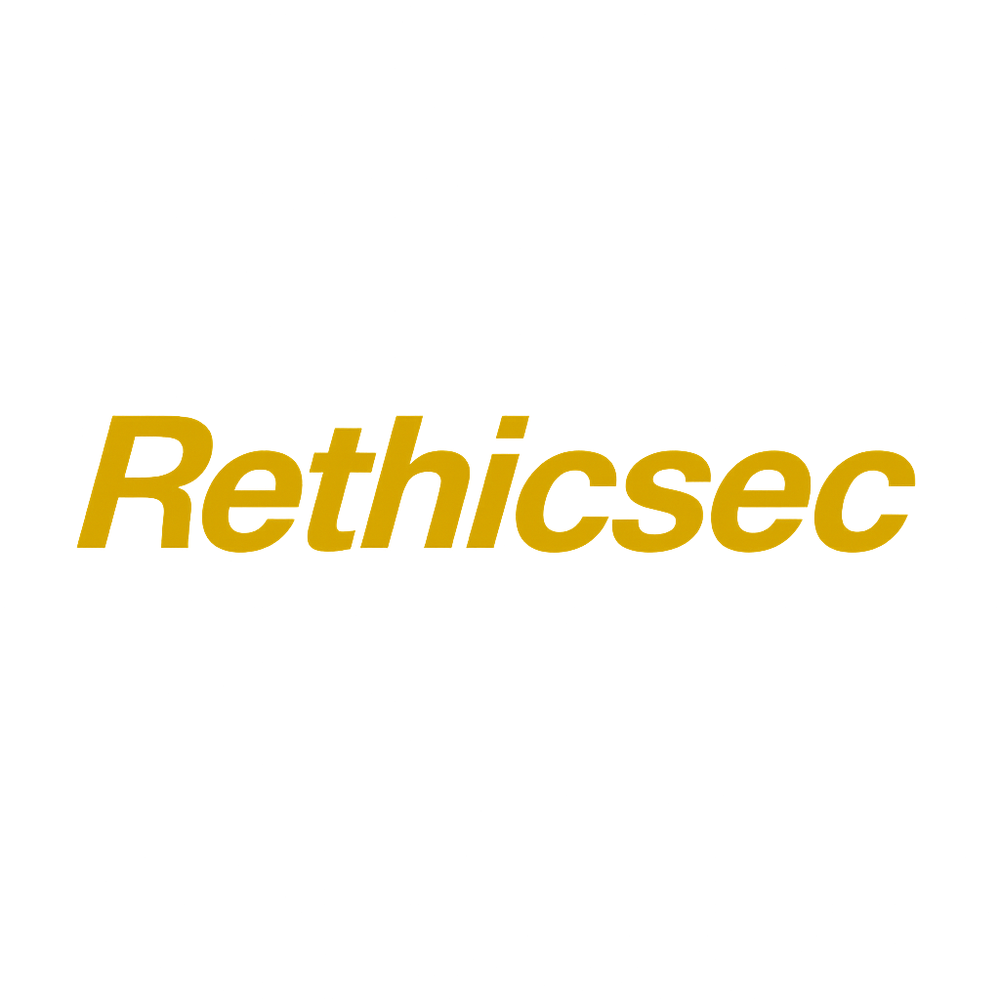

# Rethicssec – Cybersecurity Platform for Africa

A multilingual safety companion that helps people across Africa report cyber incidents, get plain‑language guidance, scan suspicious content, learn digital safety, and reach trusted emergency contacts.

- Purpose: see `README_PURPOSE.md`
- Play Store readiness & engineering guide: `docs/PLAY_STORE_READINESS.md`



## Key Features

- Incident Reporting: confidential reports with evidence upload and progress tracking.
- AI Assistant: plain‑language guidance for scams, fraud, and safety questions.
- Threat Scanner: quick checks for URLs, emails, and files with risk indicators.
- Education Hub: practical tips and learning content to build resilience.
- Emergency Contacts: fast access to local support when time matters.
- Multilingual: English, Swahili, French, Arabic, Hausa, Yoruba, Igbo, Zulu, Xhosa, Afrikaans, and Sawa (Duala).

## Tech Stack

- Flutter 3.24+ (Dart 3+), Material 3 theming
- State management: BLoC + Provider (GetIt for DI)
- Local storage: Hive; caching and offline support
- Firebase (Auth, Firestore, Storage, Functions, Analytics)
- EasyLocalization for i18n

## Getting Started

1) Install Flutter and Dart (Flutter 3.24+, Dart 3+)
2) Install dependencies

```
flutter pub get
```

3) Run the app

```
flutter run
```

## Localization Workflow

Tools live in `tool/` to keep translations in JSON and the app offline at runtime:

- Auto‑translate (free providers): `translate_assets.dart` (LibreTranslate/MyMemory)
- Verify required keys: `check_translations.dart`
- Export CSV for translators: `export_translations.dart`
- Import CSV back to JSON: `import_translations.dart`

See `docs/PLAY_STORE_READINESS.md` for full commands and details.

## Contributing & Feedback

- Purpose & vision: `README_PURPOSE.md`
- Engineering and release guide: `docs/PLAY_STORE_READINESS.md`
- Issues and suggestions are welcome — especially language improvements for African locales.

